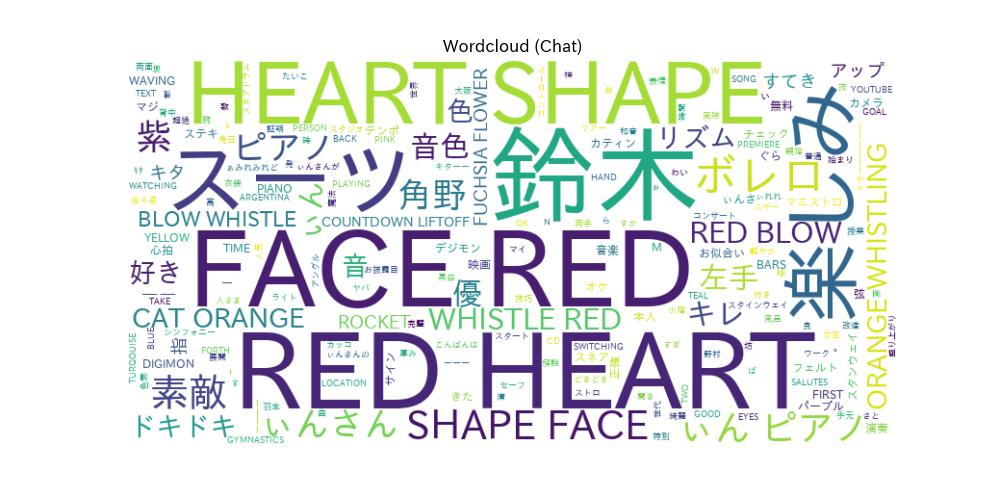
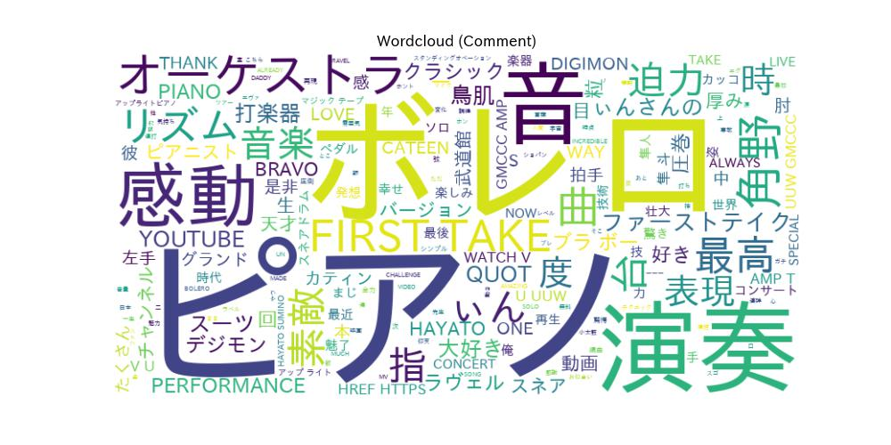
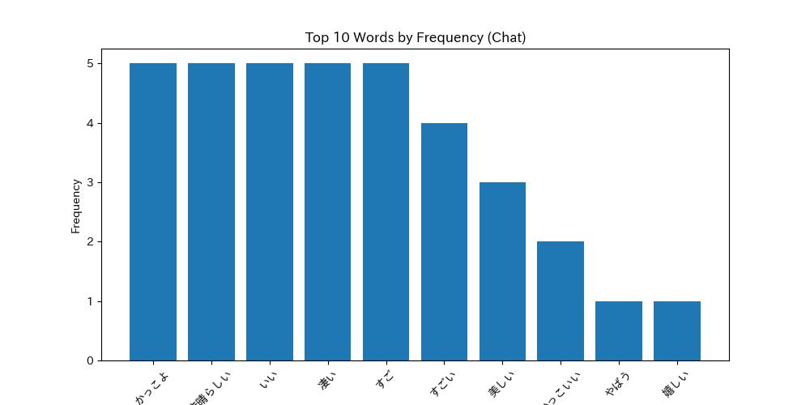
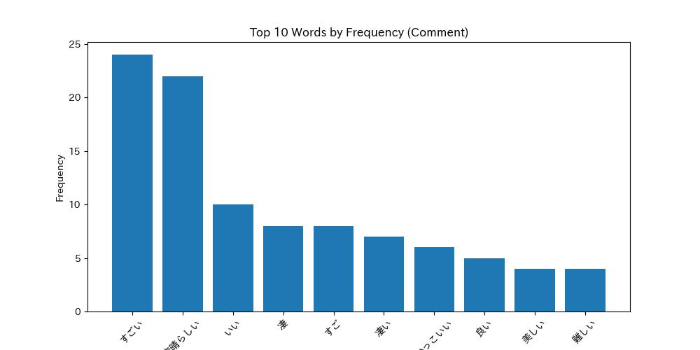

# **YouTube Chat vs. Comment Analysis Report**  

## 🔍 **Key Differences**
The analysis of YouTube comments and live chat reveals distinct differences in themes, sentiments, and language use:

### Themes:
- **Live Chat:** The conversation is dynamic and immediate, focusing on visual reactions and emotional responses. It reflects excitement and a sense of community, with users engaging in real-time discussions about the performance's visual aspects, like the musician's purple suit.
- **Comments Section:** This area emphasizes admiration for the performance's technical and emotional depth, discussing specific musical elements and the unique piano arrangement. It also highlights nostalgia and appreciation for the artist's raw talent, often linking it to personal experiences.

### Sentiments:
- **Live Chat:** The sentiment is overwhelmingly positive (80%), with a negligible amount of negative (0%) or neutral (99.2%). The excitement is palpable, with viewers expressing enthusiasm and joy.
- **Comments Section:** Sentiment here is also predominantly positive (9.3%), with a significant neutral component (90.7%). While admiration is strong, the comments reflect a more thoughtful and detailed appreciation of the performance.

### Language Use:
- **Live Chat:** The vocabulary includes expressive and immediate words like "HEART," "SHAPE," "FACE," and colors, indicating spontaneous emotional reactions. Frequent use of words like "かっこよ" (cool) and "すごい" (amazing) shows enthusiasm but with a broader distribution across various terms.
- **Comments Section:** The language is more focused on musicality, with terms such as "PIANO," "PERFORMANCE," and "感動" (emotion). The word "すごい" stands out prominently, indicating a concentrated emphasis on admiration. The discourse is reflective and detailed, showcasing a deeper engagement with the music.

In summary, live chats capture immediate excitement and community interaction, while comments reflect a more profound appreciation for musical artistry, with distinct language and emotional expressions in both formats.  

---

## **Word Cloud Analysis**
**Chats:**  
  

**Comments:**  
  

The word clouds from YouTube live chats and comments highlight distinct focal points. The live chat is dominated by words like "HEART," "SHAPE," "FACE," and colors such as "RED" and "ORANGE," indicating a dynamic and expressive conversation often focused on visual or immediate reactions, possibly to live performances or events. In contrast, the comments section emphasizes terms like "PIANO," "PERFORMANCE," "FIRST TAKE," and "感動" (kanji for "emotion" or "impression"), suggesting a more reflective and detailed discourse, likely discussing the quality of a performance, specific musical elements, or expressing appreciation and feelings. This contrast showcases the spontaneous nature of live chats versus the more considered responses typical of comment sections.  

---

## **Word Frequency Analysis**
**Chats:**  
  

**Comments:**  
  

The analysis of the two bar graphs comparing word frequency in YouTube live chats and comments reveals notable differences. In the live chat, words such as "かっこよ" and "すごい" are among the most frequently used, indicating enthusiasm and admiration, but with a more distributed frequency across different words. Conversely, in YouTube comments, "すごい" is distinctly the most prominent word, suggesting strong emphasis on amazement and admiration, with a higher concentration on top words like "素晴らしい". This indicates that comments tend to be more deliberate and focused, while live chats display a broader range of immediate emotional responses.  

---

## **Sentiment Analysis**
### **Chat Sentiments**
|            | Positive   | Neutral   | Negative   |
|:-----------|:-----------|:----------|:-----------|
| Count      | 4          | 497       | 0          |
| Percentage | 0.80%      | 99.20%    | 0.00%      |  

### **Comment Sentiments**
|            | Positive   | Neutral   | Negative   |
|:-----------|:-----------|:----------|:-----------|
| Count      | 28         | 273       | 0          |
| Percentage | 9.30%      | 90.70%    | 0.00%      |  

## **Emoji Analysis (Chats)**
| Emoji   |   Frequency |
|:--------|------------:|
| 🥁      |         292 |
| 🔥      |          96 |
| ✨      |          40 |
| 🎹      |          21 |
| 👏      |          20 |  

The emoji data from the live chat comments reveals a vibrant and enthusiastic interaction from viewers, heavily centered around musical themes, as indicated by the prominence of the drum emoji (🥁), which leads with a frequency of 292. This suggests that the content may be music-related or performance-oriented, resonating well with the audience. Other frequently used emojis, such as the fire (🔥) and sparkle (✨) emojis, indicate a strong sense of excitement and appreciation, while the clapping hands (👏) and heart emojis (❤️) reflect positive reinforcement and emotional engagement. The wide variety of emojis used, from joyful faces (😊, 😆) to celebration symbols (🎉), highlights a dynamic atmosphere in the chat, suggesting that viewers are not only enjoying the content but are also actively participating and expressing their feelings through emojis.  

---
## **Summary of Chats**
The comments express a high level of excitement and anticipation for a performance, particularly highlighting the musician's captivating purple suit and exceptional piano skills. Viewers are eager and emotional, with many expressing how the music, especially Ravel's "Boléro," resonates with them, evoking nostalgia and joy. There are numerous exclamations of enthusiasm, compliments about the performance's grandeur, and appreciation for the artist's technical abilities, including playing two pianos simultaneously. The atmosphere is vibrant, with comments reflecting a sense of community as fans share their love for the music and the performer, often greeting each other warmly. Overall, the sentiment is overwhelmingly positive, filled with admiration and excitement for the unfolding musical experience.  

## **Summary of Comments**
The comments express overwhelming admiration for Hayato Sumino's remarkable performance of Ravel's "Boléro" on piano, showcasing his extraordinary skill and unique approach. Many viewers were captivated by the one-man arrangement that evokes the presence of an entire orchestra, with comments highlighting the powerful rhythms and intricate finger work that create a rich auditory experience. The performance is praised not only for its technical brilliance but also for its emotional depth, often evoking nostalgic memories, such as connections to the "Digimon" franchise. Viewers appreciate the raw and unedited nature of the live performance, which heightens the authenticity and impact of the music. Many also express gratitude for the opportunity to witness such talent for free and hope for more classical performances on platforms like "THE FIRST TAKE." Overall, the sentiment is one of awe and appreciation for the artistry displayed, alongside a desire for further exposure to classical music through similar innovative formats.  

